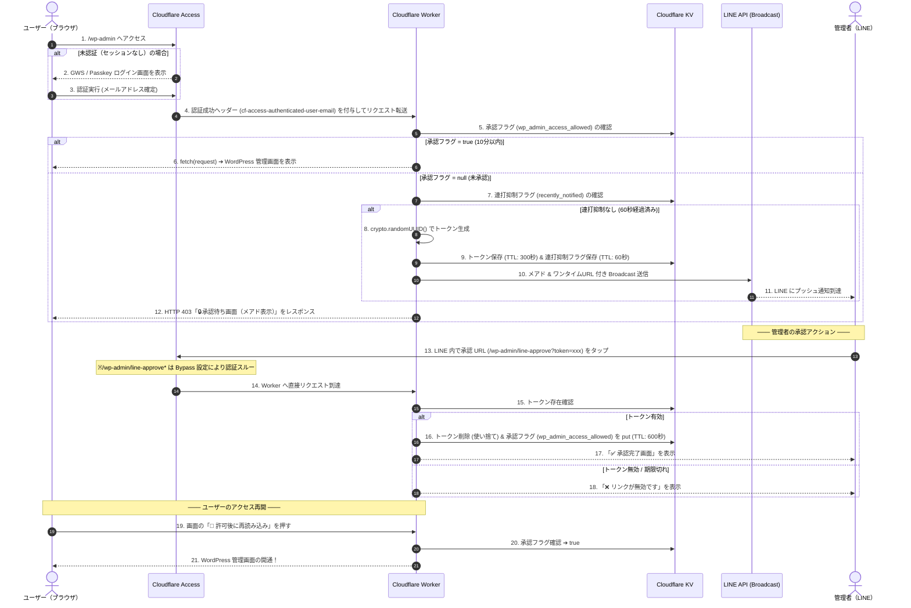

# はじめに

ここまででDNSを移行し、ゼロトラストの動作をテストでき、実際の動作を試してみることで身について来ていることを感じます。

でもここまでやったのであれば、試せることは全部試してみたい！！　そんな気持ちでGeminiと話していると、こんな話が出てきました。

**「Passkey 認証や SSO を通過したユーザーであれば、24時間365日いつでも管理画面（`/wp-admin`）にアクセスできて良いのだろうか？」**

どれほど強固な認証であっても、ログインセッションが残った端末の盗難や紛失、あるいはブラウザのセッションハイジャックといったリスクをゼロにすることはできません。常にアクセス可能な状態（常時開口）にしておくこと自体が、潜在的なアタック表面（Attack Surface）となり得ます。

この課題を根本から解決するのが、**必要な時に、必要な時間だけ、最小限の権限を与える「JIT（Just-In-Time）アクセス制御」** です。

連載第3回（最終回）となる本記事では、Cloudflare のエッジコンピューティング環境である **Workers** と **KV（Key-Value Store）**、そして日常的に利用する **LINE Messaging API** を統合し、**「ログインを検知したら管理者の LINE へ通知し、タップ後 10 分間だけ管理画面を開通させる」** ChatOps 型の動的 JIT 認可システムを構築します。

本構成で実現するセキュリティ上のハイライトは以下の通りです。

1. **アイデンティティの完全可視化**: Cloudflare Access を通過したメールアドレス（`user@example.com`）を検出・検証し、「誰がアクセスしてきたか」を LINE 通知内にリアルタイム明記。
2. **暗号的ワンタイムトークン**: 承認リンクには 5 分間有効な UUIDv4（`crypto.randomUUID()`）を埋め込み、1 回使用したら即座に削除（アトミック破棄）することでリプレイ攻撃を物理的に防止。
3. **運用コストを最小化する Broadcast 設計**: 管理者個人の `LINE_USER_ID` を固定埋め込みせず、公式アカウントの Broadcast 機能を活用。管理者グループ全員への一斉通知と、最初に着信を確認した1人によるワンタップ承認を実現。

---

# アーキテクチャと処理シーケンス

本システムにおけるリクエストの到達からアクセス判定、LINE 通知、承認、そして最終的な開通に至るまでの全体シーケンスを整理します。

### 処理シーケンス図



---

# システム設計のポイントと技術的考察

### 1. なぜ「ログイン後（Access の背後）」に Worker を配置するのか？

JIT 承認ロジックを挟み込む位置としては、大きく分けて以下の 2 パターンが考えられます。

* **パターン A（Access の前段）**: `/wp-admin` への到達時点で即座に Worker が割り込み、LINE 承認を求める。
* **パターン B（Access の後段 / 本記事採用）**: ユーザーが Access で Passkey 認証等を正常に完了した直後に Worker が JIT 判定を行う。

パターン A のメリットは「ログイン画面すら攻撃者に見せない（存在の完全隠蔽）」点にありますが、Worker 側で把握できる情報は接続元の IP アドレス等に限られ、「誰がログインしようとしているか」を判別できません。

一方、パターン B では、Cloudflare Access が認証完了時にリクエストヘッダーへ安全に注入する **`cf-access-authenticated-user-email`** を Worker で取得できます。これにより、LINE 通知本文へ **「`admin-user@example.com` からアクセス要求がありました」** と明記でき、誰からの申請であるかが一目で判別できます。

:::message
**ヘッダー偽造リスクに関するセキュリティ仕様**  
「外部の攻撃者が手元で `cf-access-authenticated-user-email` ヘッダーを捏造して送ってきたら突破されるのでは？」という懸念が生じるかもしれません。
しかし、Cloudflare のエッジインフラ仕様上、外部から流入するすべてのリクエストに含まれる Access 関連ヘッダーは、Cloudflare Access パイプライン通過時に強制破棄・再生成されます。したがって、外部攻撃者によるヘッダー偽造は技術的に不可能です。
:::

---

### 2. Cloudflare Access の Application 分割設計

メアド表示パターン（パターン B）を実装するにあたり、最も注意すべきハマりポイントが **「LINE 内蔵ブラウザにおける承認タップ時の挙動」** です。

LINE アプリで通知を受信し、トーク内の承認 URL (`/wp-admin/line-approve?token=xxx`) をタップした際、そのリクエストに対して Cloudflare Access の Google ログイン画面が起動してしまうと、LINE 内蔵ブラウザの制限によってログイン処理が失敗したり、承認完了まで過度な手間が発生したりします。

これを回避するため、Cloudflare Access 上で**アプリケーションを 2 つに分割して登録**し、URL パスの評価優先度を利用して Bypass（認証免除）を実現します。

| アプリケーション名 | 対象 Domain / Path | Policy Action | 役割 |
| :--- | :--- | :--- | :--- |
| **`WP LINE Approve Bypass`** | `test-wp.example.com` / `wp-admin/line-approve` | **Bypass** (Everyone) | LINE 承認用 URL。SSO 認証を免除し Worker のトークン検証へ直通させる |
| **`WP Admin Protection`** | `test-wp.example.com` / `wp-admin` | **Allow** (GWS / Passkey) | 通常の管理画面。SSO 認証および Passkey 認証を強制する |

Cloudflare Access は**「より長いURLパス（最長一致）」を優先して評価する**ルーティング仕様を持つため、`/wp-admin/line-approve` への通信は自動的に Bypass アプリとして評価され、認証画面を挟まずに Worker へ届きます。

---

# 詳細な構築手順

ここからは、実際に環境を構築していく具体的なステップを解説します。

## Step 1: LINE Messaging API の準備

LINE アプリへプッシュ通知を自動送信するため、LINE Developers コンソールで Messaging API チャネルを作成します。

1. [LINE Developers Console](https://developers.line.biz/) にログインし、任意のプロバイダー配下に「Messaging API」チャネルを作成します。
2. チャネル設定画面の **[Messaging API設定]** タブを開きます。
3. 一番下にある **「チャネルアクセストークン（長期）」** の [発行] ボタンをクリックしてトークンを取得し、安全に保存しておきます。


4. **[Messaging API設定]** タブ上部に表示されている QR コードをスマートフォンで読み取り、運用管理者の LINE アプリで公式アカウントを **友だち追加** します。


---

## Step 2: Cloudflare KV ネームスペースの作成

Worker がワンタイムトークンやアクセス許可状態、連打防止フラグを管理するための分散 Key-Value ストアを作成します。

1. Cloudflare ダッシュボードにログインし、左側メニューの **[Workers & Pages] > [KV]** へ移動します。
2. **[Create a namespace]** をクリックし、Namespace Name に **`LINE_APPROVAL_KV`** と入力して作成します。


---

## Step 3: Cloudflare Access アプリケーションの設定

前述した Application の分割登録を行います。


### 1. Bypass 専用アプリの作成（LINE 承認リンク用）
1. Zero Trust ダッシュボードの **[Access] > [Applications]** を開き、**[Add an application]** ➔ **[Self-hosted]** を選択します。
2. アプリケーション設定を以下のように指定します。
   * **Application name**: `WP LINE Approve Bypass`
   * **Domain**: `test-wp.example.com`（自身のドメイン）
   * **Path**: `wp-admin/line-approve` ※ここを正確に入力してください。


3. 次のポリシー設定画面で以下のように構成します。
   * **Action**: `Bypass`
   * **Policy name**: `Allow Everyone`
   * **Configure rules (Include)**: Selector で **`Everyone`** を選択
4. **[Save application]** を押して保存します。


### 2. 通常管理画面アプリの作成（SSO 保護用）※前回設定
1. 同様に **[Add an application]** ➔ **[Self-hosted]** を選択（または既存アプリを修正）。
2. アプリケーション設定:
   * **Application name**: `WP Admin Protection`
   * **Domain**: `test-wp.example.com`
   * **Path**: `wp-admin`
3. ポリシー設定:
   * **Action**: `Allow`
   * **Configure rules (Include)**: 許可対象とする Google Workspace のドメインや特定のメールアドレスグループを指定。


---

# Worker コードの実装

Cloudflare Workers にデプロイする完全な JavaScript (ES Modules) コードです。

### 実装されているロジックのポイント
* **`crypto.randomUUID()`**: 暗号学的に安全な擬似乱数生成器を用いて 128 ビットのトークンを生成。
* **`expirationTtl` オプション**: KV 保存時に有効期限（秒）を指定。Cloudflare エッジ側で自動的に削除（TTL 消滅）されるため、ガベージコレクションコードが不要。
* **ヘッダー抽出**: `request.headers.get("cf-access-authenticated-user-email")` により、認証済みユーザーの身元を完全に特定。

```javascript
export default {
  async fetch(request, env) {
    const url = new URL(request.url);

    // =========================================================
    // ① LINE から「承認リンク」がタップされた時の処理 (Bypass 経由)
    // =========================================================
    if (url.pathname === "/wp-admin/line-approve") {
      const token = url.searchParams.get("token");

      if (!token) {
        return new Response("Bad Request: Missing token", { status: 400 });
      }

      const pendingTokenKey = `pending_token_${token}`;
      const isValidToken = await env.LINE_APPROVAL_KV.get(pendingTokenKey);

      // トークンが存在しない（5分経過してTTL切れ、または既に使用済み）場合
      if (!isValidToken) {
        return new Response(`
          <!DOCTYPE html>
          <html lang="ja">
          <head>
            <meta charset="utf-8">
            <meta name="viewport" content="width=device-width, initial-scale=1.0">
            <title>エラー | 承認エラー</title>
          </head>
          <body style="font-family: -apple-system, BlinkMacSystemFont, 'Segoe UI', Roboto, sans-serif; text-align: center; padding-top: 50px; background-color: #f8f9fa; color: #333;">
            <div style="max-width: 450px; margin: 0 auto; background: #fff; padding: 30px; border-radius: 12px; box-shadow: 0 4px 12px rgba(0,0,0,0.08);">
              <h1 style="color: #d9534f; font-size: 22px; margin-bottom: 16px;">❌ 承認リンクが無効です</h1>
              <p style="font-size: 14px; line-height: 1.6; color: #666;">
                この承認リンクは有効期限（5分間）が切れているか、すでに使用されています。<br>
                再度 /wp-admin にアクセスして新しい通知を発行してください。
              </p>
            </div>
          </body>
          </html>
        `, { 
          status: 403, 
          headers: { "content-type": "text/html; charset=utf-8" } 
        });
      }

      // 【アトミック処理】使用したワンタイムトークンを即座に削除（使い捨て化）
      await env.LINE_APPROVAL_KV.delete(pendingTokenKey);

      // 10分間（600秒）有効な開通フラグを KV に保存
      await env.LINE_APPROVAL_KV.put("wp_admin_access_allowed", "true", { expirationTtl: 600 });

      return new Response(`
        <!DOCTYPE html>
        <html lang="ja">
        <head>
          <meta charset="utf-8">
          <meta name="viewport" content="width=device-width, initial-scale=1.0">
          <title>承認完了</title>
        </head>
        <body style="font-family: -apple-system, BlinkMacSystemFont, 'Segoe UI', Roboto, sans-serif; text-align: center; padding-top: 50px; background-color: #f8f9fa; color: #333;">
          <div style="max-width: 450px; margin: 0 auto; background: #fff; padding: 30px; border-radius: 12px; box-shadow: 0 4px 12px rgba(0,0,0,0.08);">
            <h1 style="color: #06C755; font-size: 22px; margin-bottom: 16px;">✅ アクセスを許可しました</h1>
            <p style="font-size: 14px; line-height: 1.6; color: #666;">
              今後 <strong>10分間</strong> /wp-admin へのアクセスが開通します。<br>
              元のブラウザに戻ってページを再読み込みしてください。
            </p>
          </div>
        </body>
        </html>
      `, { 
        headers: { "content-type": "text/html; charset=utf-8" } 
      });
    }

    // =========================================================
    // ② Cloudflare Access を通過してきた通常のアクセス処理
    // =========================================================
    
    // Access が付与するヘッダーから認証済みメールアドレスを取得
    const userEmail = request.headers.get("cf-access-authenticated-user-email");

    // ヘッダーが存在しない＝Access を経由していない不正アクセスのため拒否
    if (!userEmail) {
      return new Response("Unauthorized: Cloudflare Access authentication required", { status: 401 });
    }

    // KV から 10分以内の承認フラグを取得
    const isApproved = await env.LINE_APPROVAL_KV.get("wp_admin_access_allowed");

    // 承認済み（フラグ = "true"）なら、WordPress オリジンへ通信を通す
    if (isApproved === "true") {
      return fetch(request);
    }

    // 未承認の場合：ワンタイムトークンを生成して LINE Broadcast 通知を送信
    const recentlyNotified = await env.LINE_APPROVAL_KV.get("recently_notified");

    if (!recentlyNotified) {
      // 128bit のランダム UUID を発行
      const oneTimeToken = crypto.randomUUID();

      // トークンを 5分間（300秒）だけ有効として KV に保存
      await env.LINE_APPROVAL_KV.put(`pending_token_${oneTimeToken}`, "true", { expirationTtl: 300 });

      const approveUrl = `${url.origin}/wp-admin/line-approve?token=${oneTimeToken}`;

      // LINE Messaging API (Broadcast) 呼び出し
      await fetch("[https://api.line.me/v2/bot/message/broadcast](https://api.line.me/v2/bot/message/broadcast)", {
        method: "POST",
        headers: {
          "Content-Type": "application/json",
          "Authorization": `Bearer ${env.LINE_CHANNEL_ACCESS_TOKEN}`
        },
        body: JSON.stringify({
          messages: [{
            type: "text",
            text: `🚨 【/wp-admin アクセス要求】\n\n以下の認証済みユーザーから管理画面へのアクセス試行がありました。\n\n👤 ユーザー: ${userEmail}\n\n10分間アクセスを許可する場合は、以下のリンクをタップしてください（5分間・1回のみ有効）：\n${approveUrl}`
          }]
        })
      });

      // スパム通知防止のため、60秒間の通知抑制キーをセット
      await env.LINE_APPROVAL_KV.put("recently_notified", "true", { expirationTtl: 60 });
    }

    // アクセスしたユーザー（ブラウザ）に表示する 403 待機画面
    return new Response(`
      <!DOCTYPE html>
      <html lang="ja">
      <head>
        <meta charset="utf-8">
        <meta name="viewport" content="width=device-width, initial-scale=1.0">
        <title>ロック状態 | 承認待ち</title>
      </head>
      <body style="font-family: -apple-system, BlinkMacSystemFont, 'Segoe UI', Roboto, sans-serif; text-align: center; padding-top: 50px; background-color: #f8f9fa; color: #333;">
        <div style="max-width: 480px; margin: 0 auto; background: #fff; padding: 32px; border-radius: 12px; box-shadow: 0 4px 12px rgba(0,0,0,0.08);">
          <div style="font-size: 40px; margin-bottom: 12px;">🔒</div>
          <h2 style="color: #d9534f; font-size: 20px; margin-bottom: 12px; font-weight: 600;">管理画面はロックされています</h2>
          <p style="font-size: 14px; color: #495057; margin-bottom: 8px;">
            <strong>${userEmail}</strong> として SSO 認証されました。
          </p>
          <p style="font-size: 13px; color: #6c757d; line-height: 1.5; margin-bottom: 24px;">
            管理者の LINE アプリへ承認リクエストを送信しました。<br>
            LINE で「許可」をタップした後、下のボタンを押してください。
          </p>
          <button onclick="location.reload()" style="background-color: #06C755; color: white; border: none; padding: 12px 28px; border-radius: 6px; font-size: 15px; font-weight: bold; cursor: pointer; transition: background 0.2s;">
            🔄 許可後にページを再読み込み
          </button>
          <p style="font-size: 11px; color: #adb5bd; margin-top: 20px;">
            ※承認リンクの有効期限は 5 分間です。
          </p>
        </div>
      </body>
      </html>
    `, {
      status: 403,
      headers: { "content-type": "text/html; charset=utf-8" },
    });
  }
};
```

---

# Worker のデプロイと環境設定

1. Cloudflare ダッシュボードの **[Workers & Pages]** から新規 Worker（例: `wp-line-jit-auth`）を作成し、上記のコードを貼り付けてデプロイします。
2. Worker の管理画面で **[Settings] > [Variables]** に移動し、以下のバインドおよび環境変数を登録します。
   * **KV Namespace Bindings**:
     * Variable name: `LINE_APPROVAL_KV`
     * KV namespace: `LINE_APPROVAL_KV` を選択
   * **Environment Variables**:
     * Variable name: `LINE_CHANNEL_ACCESS_TOKEN`
     * Value: Step 1 で取得した LINE の長期アクセストークン（Encrypt 設定を推奨）


3. **[Domains & Routes]**（または [Triggers]）を開き、**[+ Add] ➔ [Route]** を追加します。
   * **Route**: `test-wp.example.com/wp-admin*`
   * **Zone**: 対象の独自ドメインを選択


---

# セキュリティ評価と設計の堅牢性

本アーキテクチャのセキュリティ的な利点と、想定される攻撃シナリオに対する防御策を整理します。

### 1. 暗号的探索空間と総当たり攻撃（Brute Force）の不可能性
ワンタイムトークンに使用されている `crypto.randomUUID()` は、UUIDv4（RFC 4122）規格に従い 122 ビットの可変乱数領域を持ちます。取り得る値の総数は $2^{122} \approx 5.3 \times 10^{36}$ 通りです。

有効期限である 5 分間（300 秒）の間に攻撃者がランダムリクエストを送信して有効なトークンを言い当てる確率は、実用上完全にゼロとみなせます。

### 2. リプレイ攻撃（Replay Attack）の阻止
クエリパラメーターに固定のシークレットキーを付与する方式では、ブラウザ履歴、中間プロキシログ、画面の盗み見等で URL が漏洩した場合、悪用されるリスクが残ります。

本システムでは、LINE 上でタップされた瞬間に Worker 内の `env.LINE_APPROVAL_KV.delete(pendingTokenKey)` が呼び出されます。トークンは**アトミックに消費・消去**されるため、同じ URL を再度クリックしても必ず `403 Forbidden` となり、再利用攻撃を完全に防ぎます。

### 3. ソーシャルエンジニアリング（誤タップ・疲弊攻撃）への多層防御
唯一懸念される運用リスクは、「第三者が `/wp-admin` へリクエストを発生させ、管理者が意図せず LINE の承認ボタンを押してしまう（フィッシング・疲弊攻撃）」パターンです。

これに対しては、以下の**3重の防御メカニズム**が機能します。

1. **メアド明記による認識**: LINE 通知内に `👤 ユーザー: xxx@example.com` が記載されるため、自分以外のアクセス試行であることを即座に判定可能。
2. **連打抑制（Rate Limiting）**: 60 秒間の `recently_notified` フラグにより、連続アクセスがあっても LINE 通知のスパム化（Notification Fatigue）を抑止。
3. **後段の Access 制御**: 仮に誤って LINE で承認を与えてしまっても、攻撃者自身が Cloudflare Access の Passkey や Google ログインをクリアしていない限り、WordPress 管理画面へ進入することは不可能です。

---

# 動作確認と検証手順

構築完了後、以下のテスト手順に従って正常動作を確認します。

### 1. 未承認状態でのアクセス確認
シークレットウィンドウを開き、`https://test-wp.example.com/wp-admin` にアクセスします。

1. まず **Cloudflare Access の SSO ログイン画面**が表示されるため、許可された Google アカウント等で認証します。


2. 認証完了直後、画面が切り替わり、以下の **「🔒 管理画面はロックされています」** 画面が表示されることを確認します。画面上にはログインした自身のメールアドレスが正しく表示されます。


### 2. LINE 通知の受信確認
管理者のスマートフォンに LINE プッシュ通知が届きます。

* メッセージ本文に自身のメールアドレスが記載されていることを確認します。
* 承認用 URL が `https://test-wp.example.com/wp-admin/line-approve?token=...` であることを確認します。


### 3. JIT 承認の実行
LINE アプリ内で承認リンクをタップします。

* Cloudflare Access のログイン画面を挟むことなく、LINE 内蔵ブラウザで **「✅ アクセスを許可しました」** という画面が表示されることを確認します（Bypass アプリの動作確認）。


### 4. 管理画面の開通確認
PC ブラウザに戻り、画面内の **「🔄 許可後にページを再読み込み」** ボタンをクリックします。

* 承認フラグが正常に確認され、WordPress の管理画面（`/wp-admin/`）が開くことを確認します。


### 5. 使い捨て・TTL の検証
* **使い捨て確認**: LINE アプリに戻り、使用済みの承認リンクを再タップします。**「❌ 承認リンクが無効です」** と表示されることを確認します。
* **10分タイマー確認**: 承認から 10 分経過後、PC ブラウザをリロードして自動的にロック画面（403）に戻ることを確認します。

### 6.KVの確認
* **JIT開始時**: 自動生成されたトークンと、連打での通知発行を止める値がtrueになっています。


* **JIT完了時**: 自動生成されたトークンと連打用の値が削除され、LINEで承認された値だけが表示されます。これも10分で削除され、失効後は再度承認が必要になります。


---

# トラブルシューティング

構築時によく発生する問題と対処法です。

### Q1. LINE アプリで承認リンクを押した際、Google のログイン画面が出てしまう
* **原因**: Bypass アプリの URL パス指定または優先度が正しく設定されていません。
* **対策**: Cloudflare Access の Application 設定で `wp-admin/line-approve` を Domain / Path に持つ Bypass アプリ（Action: Bypass, Include: Everyone）が存在するか再確認してください。

### Q2. LINE に通知が届かない
* **原因**: Worker の環境変数不備、または LINE アクセストークンの不整合です。
* **対策**: Cloudflare Workers の [Real-time Logs] を有効にした状態で `/wp-admin` にアクセスし、LINE API 呼び出しのログを確認します。`401` エラーの場合は `LINE_CHANNEL_ACCESS_TOKEN` の設定値を確認してください。

---

# まとめとエンタープライズ展望

全 3 回にわたる連載を通じて、自宅サーバーでホストする WordPress に対する最高峰の防御構成を組み上げました。

```text
【第1回: インバウンド保護】
  Cloudflare Tunnel によるオリジン IP 隠蔽 ＆ ポート開放ゼロ化
        ↓
【第2回: アイデンティティ認証】
  Cloudflare Access による SSO / パスキー（Passkey）強力認証
        ↓
【第3回: 動的認可 (本記事)】
  Workers + KV + LINE ChatOps によるメアド識別型ワンタイム JIT 承認
```

これにより、**「ポートは閉じられており、SSO/Passkey 認証をクリアし、かつ管理者が LINE で直前にタップ許可を出した 10 分間のみしか開かない」** という、完全な多層防御（Defense in Depth）を実現しました。

### おわりに

ゼロトラストという単語が自分の中でずっと馴染んでいない感覚がずっとありましたが、GWSの導入とCloudflareの機能を使用することで、少しずつ理解が進んでいったように思います。

認証だけではなく、認可も考えて検証してみたことで、どのネットワークからも信頼せずにアクセスしてきた端末に何を許可させるか、そのあたりを考えるのが面白くなってきました。

エンタープライズ環境なら端末やユーザーのリスク評価で制御もできます。

Okta Developerでそのあたりができるとの話も耳にしたので、どこかでOktaを使用したSSO＋Cloudflareでのゼロトラストでモダンな認証環境を構築してみたいと思います！